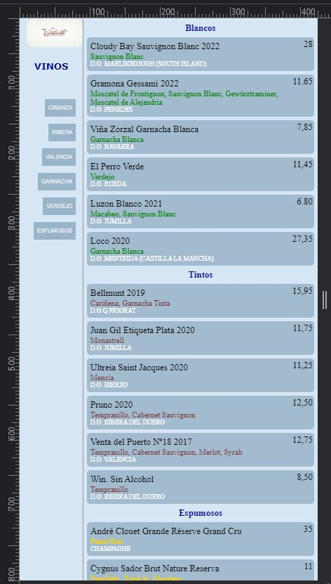

# Wine List Two
 Same as [Wine-List-One](https://github.com/edocybdezad/Wine-List-One.git) but using Strapi CMS - deployed on [Render](https://render.com/) - to store content. Also render provides the web services

 This basic web page uses as UI base [Wine-List-UI](https://github.com/edocybdezad/Wine-List-UI.git).
 
Note: As a free account in Render is used for this project. In 90 days render
desactivates the database. PSQL db by the case.

About strapi I found is not that easy as I heard (maybe for some devs it is). it is better to start the project with a hosted PSQL. See acknowledgements part

## Installation
- Use the code tab to download the zip file. 

## Usage

- Unzip the folder and run the file index.html using Live Server or similar. VScode has Live Server extension by default.

## Technologies
- HTML
- CSS
- JavaScript
- Strapi *
- Node.js *
- Cloudinary *
* Not required to run this repo

## Screnshot

## Acknowledgements
- [Programming Night, Tutorial](https://www.youtube.com/watch?v=akvItcWW81g)
- [Baptiste Studer](https://github.com/Baboo7), for his [Strapi Plugin Import Export Entries](https://github.com/Baboo7/strapi-plugin-import-export-entries.git)